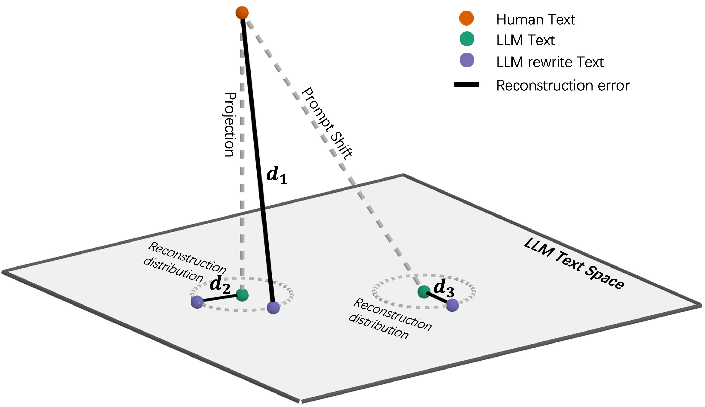

# Learn-to-Distance (L2D): Distance Learning for Detecting LLM-Generated Text ✨

[](https://openreview.net/forum?id=2ZUPeEM3FH)


This repository contains the official implementation of **[Learn-to-Distance: Distance Learning for Detecting LLM-Generated Text](https://openreview.net/forum?id=2ZUPeEM3FH)** (accepted at **ICLR 2026**).  

L2D provides a **geometric projection** viewpoint on the effectiveness of rewrite-based detectors (**Figure 1** 🧠)  
and strengthens this paradigm via **distance learning** (**Figure 2** 🧭).

<figure style="margin: 0;">
  <p align="center" style="margin: 0;">
    
  </p>
  <p align="center" style="margin: -12px 0 0 0;">
    <sub><b>Figure 1.</b> 🧠 Projection intuition behind rewrite-based detection. (Click to expand the full explanation 👇)</sub>
  </p>
</figure>

<details style="margin: -8px 0 0 0;">
  <summary><b>📝 Full explanation for Figure 1</b></summary>
  The brown dot represents a human-authored text after embedding, while the two green dots represent its projection onto the LLM subspace and an LLM-generated text produced from an unobserved prompt, respectively. From left to right, the purple dots denote the reconstructions of the first green dot, the brown dot and the second green dot. As illustrated, <b>d₁ &gt; d₂</b>, indicating that the reconstruction error for human text is larger than that for LLM-generated text, which aligns with Proposition 1 in the paper. Additionally, <b>d₁ &gt; d₃</b> suggests that rewrite-based methods remain robust to prompt-induced distribution shifts, as formalized in Proposition 2 in the paper.
</details>

<p align="center" style="margin: 10px 0 0 0;"></p>
<figure style="margin: 0;">
  <p align="center" style="margin: 0;">
    
  </p>
  <p align="center" style="margin: -12px 0 0 0;">
    <sub><b>Figure 2.</b> 🧭 Workflow of the proposal: our method adaptively learns a distance metric to measure the discrepancy between human and LLM-generated texts for detection.</sub>
  </p>
</figure>


## 🛠️ Installation

### Requirements
- Python 3.10.8
- PyTorch 2.7.0
- CUDA-compatible GPU (experiments conducted on H20-NVLink with 96GB memory)

### Setup
```bash
./setup.sh
```

## 🚀 Usage

### Run on a dataset with a pretrained checkpoint

Recommended for **off-the-shelf** usage.  

```bash
python scripts/detect_l2d.py --from_pretrained mamba413/L2D   --eval_dataset example/demo --output_file example/demo --eval_only
```

**Pretrained checkpoint details**
- Rewrite model: [`google/gemma-2-9b-it`](https://huggingface.co/google/gemma-2-9b-it)
- Training data: texts generated by **GPT-4o**, **Gemini-2.5**, and **Claude-3.5**
- LoRA adapter on Hugging Face: [`mamba413/L2D`](https://huggingface.co/mamba413/L2D/tree/main)

**If you want better / cheaper rewriting**
- Consider a smaller rewrite model such as [`Qwen/Qwen3-4B`](https://huggingface.co/Qwen/Qwen3-4B), or bring your own rewrite model / dataset.

---

### Train / evaluate on your own data

Recommended when you want to:
- 🔧 improve performance on your specific domain, or
- ⚖️ fairly compare with other *training-based* methods.

#### 1) Prepare your dataset
Provide a `.json` file named `xxx.raw_data.json` with the following structure:

```json
{
  "original": ["human-text-1", "human-text-2", "..."],
  "sampled": ["machine-text-1", "machine-text-2", "..."]
}
```

- `original`: human-written texts
- `sampled`: machine-generated texts (from one or more LLMs)
- The two lists should typically be aligned in length (one-vs-one), unless your pipeline explicitly supports otherwise.

#### 2) Train (and optionally save) a checkpoint
```bash
python scripts/detect_l2d.py --train_dataset "./exp_prompt/data/squad_claude-3-5-haiku" --save_trained
```

By default, checkpoints are saved to `./scripts/AdaDist/ckpt/`

#### 3) Evaluate with your trained checkpoint
```bash
python scripts/detect_l2d.py --eval_only --eval_dataset your_data --output_file your_result --from_pretrained ./scripts/AdaDist/ckpt/
```

---

## 🎁 Additional Resources

The `scripts/` directory contains implementations of various LLM detection methods from the literature. These implementations are modified from their official versions or from **AdaDetectGPT** to provide:
- consistent input/output formats
- simplified method comparison

### Implemented baselines

| Method                      | Script File            | Paper/Website                                                   |
| --------------------------- | ---------------------- | --------------------------------------------------------------- |
| **AdaDetectGPT**            | `detect_gpt_ada.py`    | [arXiv:2510.01268](https://arxiv.org/abs/2510.01268)            |
| **BARTScore**               | `detect_bartscore.py`  | [EMNLP-main.463](https://aclanthology.org/2023.emnlp-main.463/) |
| **Binoculars**              | `detect_binoculars.py` | [arXiv:2401.12070](https://arxiv.org/abs/2401.12070)            |
| **Fast-DetectGPT**          | `detect_gpt_fast.py`   | [arXiv:2310.05130](https://arxiv.org/abs/2310.05130)            |
| **GLTR**                    | `detect_gltr.py`       | [arXiv:1906.04043](https://arxiv.org/abs/1906.04043)            |
| **IDE**                     | `detect_ide.py`        | [arXiv:2306.04723](https://arxiv.org/abs/2306.04723)            |
| **ImBD**                    | `detect_ImBD.py`       | [arXiv:2412.10432](https://arxiv.org/abs/2412.10432)            |
| **Likelihood**              | `detect_likelihood.py` | [arXiv:2306.05540](https://arxiv.org/abs/2306.05540)            |
| **LRR**                     | `detect_lrr.py`        | [arXiv:2306.05540](https://arxiv.org/abs/2306.05540)            |
| **RADAR**                   | `detect_radar.py`      | [arXiv:2307.03838](https://arxiv.org/abs/2307.03838)            |
| **RADIAR**                  | `detect_radiar.py`     | [arXiv:2401.12970](https://arxiv.org/abs/2401.12970)            |
| **RoBERTa OpenAI Detector** | `detect_roberta.py`    | [arXiv:1908.09203](https://arxiv.org/abs/1908.09203)            |

We build upon and extend code from **[AdaDetectGPT](https://github.com/Mamba413/AdaDetectGPT)**.

### Reproducibility guide
- `exp_diverse.sh`: generate Table 1 and Tables B1–B4
- `exp_prompt.sh`: generate Table 2

After running the above code, use:
```bash
python script/report_results.py
```
You can call either `report_black_prompt_results` or `report_diverse_results` to render the tables/figures.

- `exp_attack.sh`: reproduce Figure 4 (use `fig4.py` to produce Figure 4 in the main text)


## 📖 Citation

If you find this work useful, please consider citing our paper:

```bibtex
@inproceedings{zhou2026learn,
  title={Learn-to-Distance: Distance Learning for Detecting LLM-Generated Text},
  author={Hongyi Zhou and Jin Zhu and Erhan Xu and Kai Ye and Ying Yang and Chengchun Shi},
  booktitle={The Fourteenth International Conference on Learning Representations},
  abbr={ICLR},
  year={2026},
}
```

If you have any questions, please feel free to open an [issue](https://github.com/Mamba413/L2D/issues).
